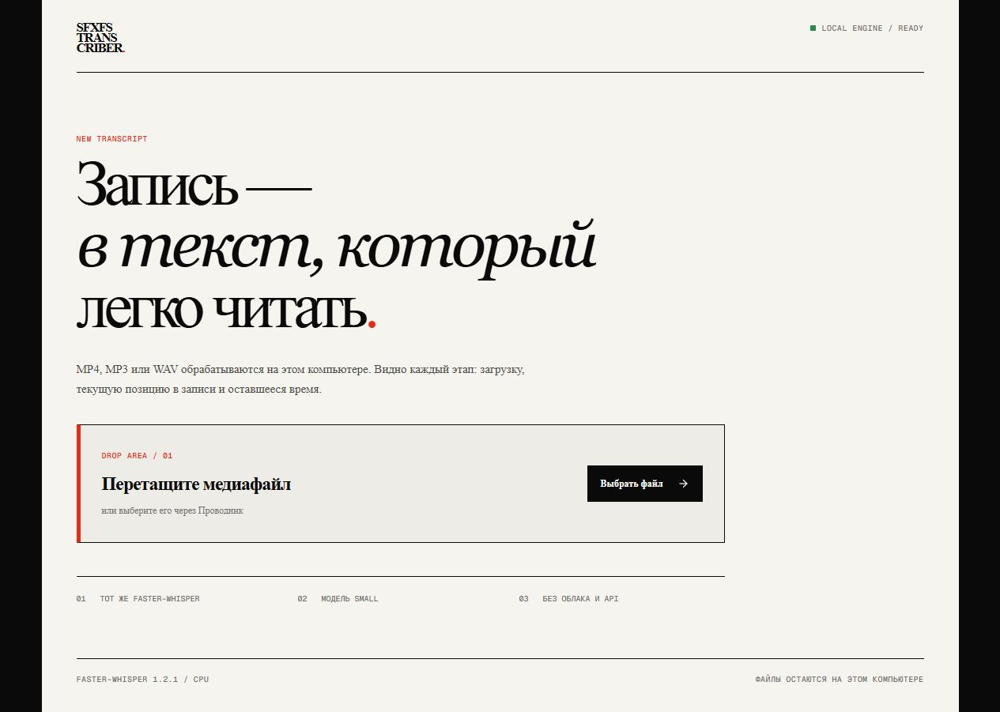

# SFXFS Transcriber

Локальное веб-приложение для транскрибации `MP4`, `MP3` и `WAV` в обычный текст или Markdown с таймкодами.

Работает через **faster-whisper** на компьютере пользователя: медиафайлы не отправляются в облачный API.



## Возможности

- перетаскивание файла в окно браузера или выбор через Проводник;
- поддержка `MP4`, `MP3` и `WAV`;
- русский, английский и автоматическое определение языка;
- живой прогресс по этапам обработки;
- текущая позиция в записи, прошедшее время и ETA;
- появление распознанных фрагментов во время работы;
- остановка активной задачи;
- копирование готового текста;
- экспорт в `TXT` и `Markdown` с таймкодами;
- локальная обработка без ключей и платного API;
- понятная ошибка для MP4 без звуковой дорожки.

## Быстрый запуск на Windows

Понадобятся:

- Windows 10 или 11;
- Python 3.10+;
- Node.js 22+;
- интернет только при первой установке зависимостей или загрузке модели.

Скачайте проект и дважды щёлкните:

```text
START_APP.cmd
```

Лаунчер автоматически:

1. создаст изолированное Python-окружение;
2. установит зависимости;
3. соберёт интерфейс, если готовой сборки нет;
4. запустит локальный backend и frontend;
5. откроет приложение в браузере.

Для остановки фоновых процессов запустите:

```text
STOP_APP.cmd
```

По умолчанию интерфейс доступен по адресу `http://127.0.0.1:4173/`, а локальный API — `http://127.0.0.1:8765/`.

## Модель распознавания

Приложение использует тот же стек, на котором выполнялась транскрибация русских реплик Postal 2:

- `faster-whisper 1.2.1`;
- модель Whisper `small`;
- `CTranslate2`;
- вычисления на CPU в режиме `int8`;
- `beam_size=3`.

Модель `small` занимает примерно 460 МБ. При первом распознавании она загружается в локальную папку `models`. Если на компьютере существует прежний проект Postal 2 с уже скачанной моделью, Windows-лаунчер попробует использовать её повторно.

## Форматы результата

### TXT

Чистый связный текст в кодировке UTF-8 с BOM — корректно открывается в стандартном Блокноте Windows.

### Markdown

Документ содержит:

- имя исходного файла;
- дату создания;
- модель и определённый язык;
- длительность записи;
- связный текст;
- отдельные фрагменты с начальными и конечными таймкодами.

Результаты сохраняются в локальной папке `results` и доступны для скачивания прямо из интерфейса.

## Ручной запуск для разработки

### Backend

```powershell
python -m venv .venv
.\.venv\Scripts\python.exe -m pip install -r requirements.txt
.\.venv\Scripts\python.exe -m uvicorn server.app:app --host 127.0.0.1 --port 8765
```

### Frontend

```powershell
npm install
npm run dev
```

Development-интерфейс откроется на `http://localhost:3000/`.

## Структура проекта

```text
app/                 интерфейс приложения
components/ui/       базовые UI-компоненты
server/app.py        локальный API и очередь распознавания
scripts/             Windows-лаунчеры
docs/                изображения для документации
START_APP.cmd        запуск приложения
STOP_APP.cmd         остановка приложения
requirements.txt     Python-зависимости
```

## Приватность

- Исходный файл копируется во временную локальную папку только на время задачи.
- Временная копия удаляется после завершения, отмены или ошибки.
- Никакие API-ключи не нужны.
- Модель работает локально; содержимое записи не отправляется в облачный сервис.
- `models`, `results`, `.venv`, `node_modules`, логи и временные файлы исключены из Git.

## Ограничения

- Скорость зависит от процессора и длительности записи.
- Первый запуск дольше последующих из-за установки зависимостей и загрузки модели.
- В текущей версии задачи обрабатываются по одной, чтобы не перегружать CPU.
- Автоматическое разделение нескольких говорящих по именам не выполняется.

## Технологии

- React 19 + TypeScript
- Vinext / Vite
- Tailwind CSS + shadcn primitives
- FastAPI + Uvicorn
- faster-whisper + CTranslate2 + PyAV

---

**SFXFS Transcriber** is a privacy-first local transcription app for MP4, MP3 and WAV. It provides live processing progress, timestamps, and TXT/Markdown exports without uploading media to a cloud transcription API.
